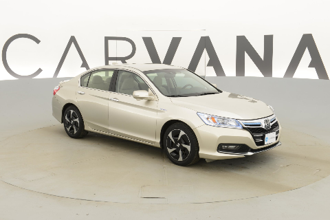
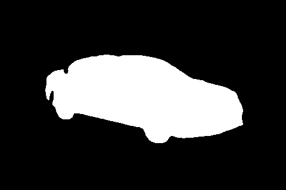

## Image Segmentation Project - (Kaggle Carvana Image Masking Challenge)

The following is the solution for [Kaggle Carvana Image Masking Challenge](https://www.kaggle.com/c/carvana-image-masking-challenge)

The solution is made from following Youtube Tutorial by [Aladdin Pearson](https://youtu.be/IHq1t7NxS8k?si=sZ8eAuGpFZeGhiA_). After the model training. I have exteded the code to segment any similar car image, by inferencing from the saved model.

### Instructions:
* Download the Carvana Dataset from above kaggle competetion link.
* Create train and valdiation folders inside the data folder.
* Run **train.py** to train and save the model checkpoint.
* For inferencing a random image downloaded from internet:
    * Download the image/images and put it into the **inference_images** folder inside a sub folder named **input**.
    * Run **infer_imgs.py** file.
    * The output will appear in **output** folder inside **inference_images**

### Model Inference
Input Image:

Output Image:

